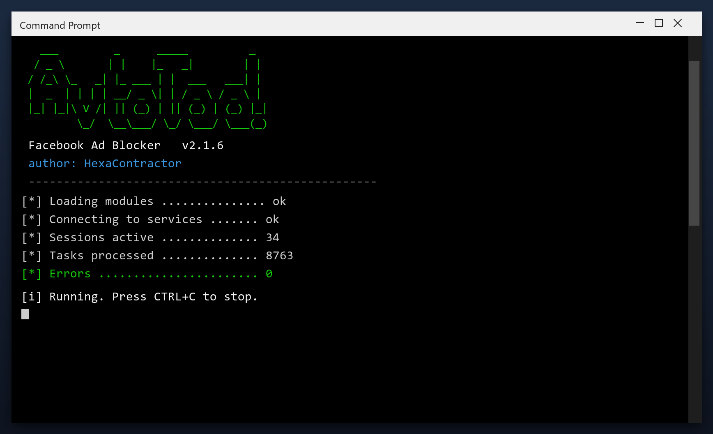

# Facebook Ad Blocker — Free Download [2026]

  

If your PC feels slower than it used to, **facebook ad blocker** is the fix. It clears the clutter that builds up over months of use and restores the speed you had on day one. Current 2026 build for Windows 10 and 11.

  

  

## What It Does

Facebook ad blocker is a small Windows tool for routine maintenance. You do not need to understand the technical details - it reports what it found in plain language and only changes things after you agree. Nothing runs in the background and nothing phones home.

| **Term** | **Meaning** |
| --- | --- |
| **Plain language** | No technical jargon |
| **Report** | A summary of what was found |
| **Confirm** | You approve before changes |
| **No telemetry** | Nothing is sent anywhere |

## Requirements

| **Component** | **Minimum** | **Notes** |
| --- | --- | --- |
| **Windows** | 10 (64-bit) | 11 fully supported |
| **RAM** | 2 GB | 4 GB for large scans |
| **Disk** | 100 MB | Plus space to clean |
| **Account** | Standard | Admin for full cleanup |

## Install in a Nutshell

1. **Get the file** with the button below
2. **Allow** it in Windows SmartScreen (More info, Run anyway)
3. **Open** the tool
4. **Press Start scan** and wait a couple of minutes
5. **Click Clean** to remove what was found

> **Note:** on first launch Windows may show a SmartScreen warning because the file is new. Click More info, then Run anyway.

## Features

| **Feature** | **Details** |
| --- | --- |
| **Supported systems** | Windows 10 and 11 |
| **Scheduling** | Optional automatic scans |
| **Undo** | Restore point created first |
| **Interface** | Simple, plain English |
| **Safety** | Scanned and tested build |
| **Version** | Current 2026 release |

## FAQ

**Do I need to be technical?**

No. It shows plain buttons and a clear report - no settings to understand.

**Will it slow my PC while running?**

Only during a scan. It throttles itself when you are using the computer.

**Does it run in the background?**

No. It only works when the window is open.

**Can I undo a cleanup?**

Yes - a restore point is created before any change.

**Is there a paid version?**

No. Everything is included and free.

---

*vivid-harbor-204 · Updated 2026-10-09 · Shared under the MIT License*
